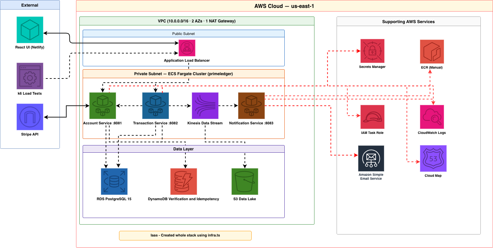
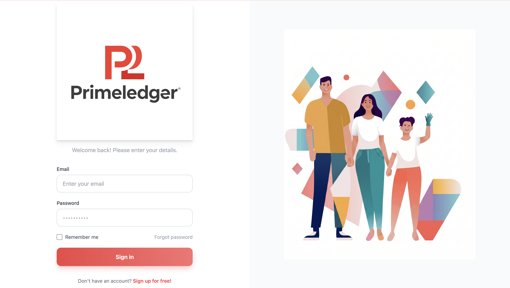
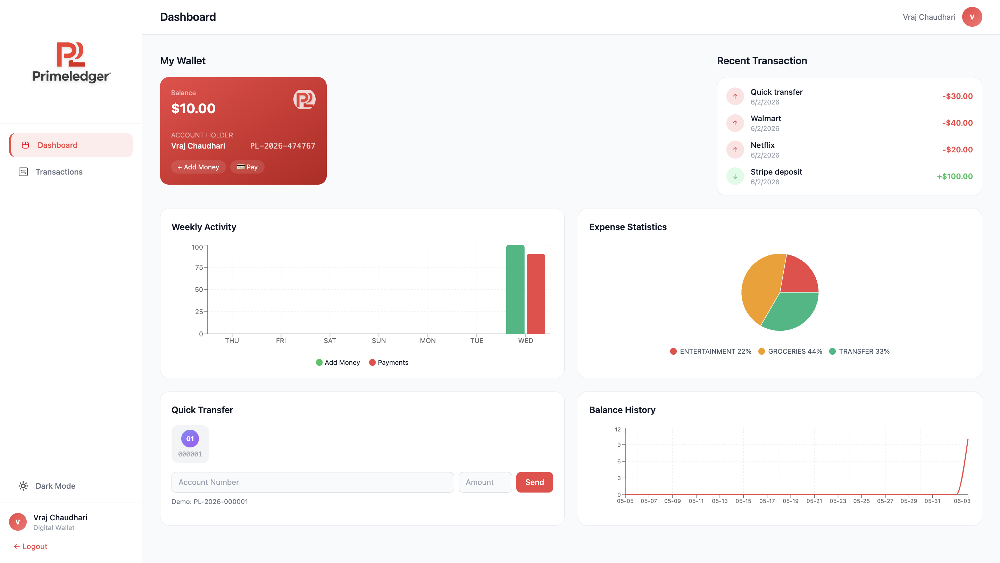
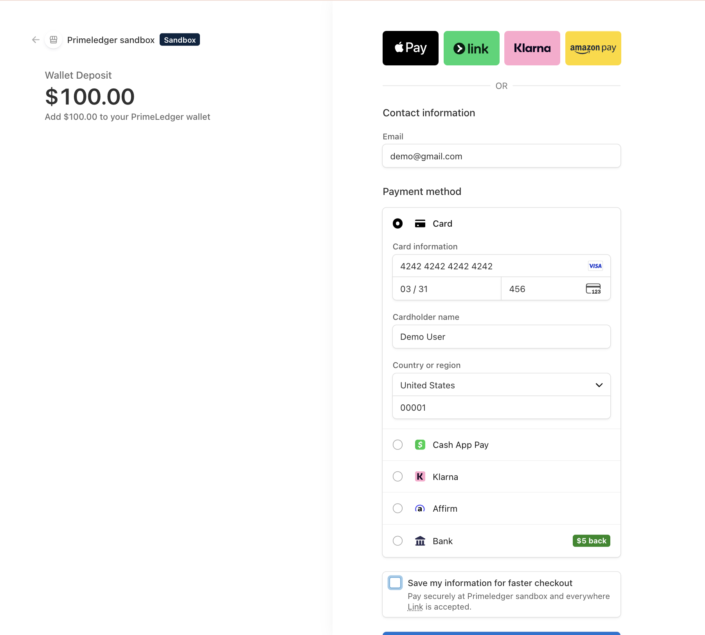

# PrimeLedger Wallet — Scalable Event-Driven Digital Wallet Platform

PrimeLedger is a production-grade, event-driven digital wallet application built as a distributed microservices architecture. It handles user wallets, real-time payments, peer-to-peer transfers, and secure authentication at scale — leveraging **Java Spring Boot**, **AWS cloud-native services**, and **Stripe** for payment processing.

This isn't a tutorial project. It was engineered to solve real distributed systems problems: concurrent balance updates causing lost money (fixed with optimistic locking), duplicate charges on network retries (prevented with idempotency keys), and tightly coupled services that fail together (decoupled via event streaming). Every architectural decision maps to a specific problem in the original monolithic codebase.

## NOTE: The Application is currently hosted on: https://primeledgerwallet.netlify.app/login
The application frontend is hosted on netlify and backend is hosted on AWS. However the aws stack is destroyed to save cost. If you want to see how Application UI will be, you can check the attached screenshots in README.md. I am planning to upload a working tutorial of the application in future as soon as possible.

## 🚀 Core Features

- **Microservices Architecture**: Fully decoupled `Account Service`, `Transaction Service`, and `Notification Service` — each independently deployable, scalable, and maintainable.
- **Event-Driven Processing**: Transactions publish events to **Kinesis Data Streams**. The Notification Service consumes asynchronously — a failed email never blocks a payment.
- **Stripe Payment Integration**: Real Stripe Checkout for wallet deposits. Users pay with test cards, webhooks confirm payment, balance updates atomically.
- **Optimistic Locking**: `@Version` on the Account entity prevents lost updates when concurrent requests modify the same balance — the system throws a conflict rather than silently losing money.
- **Flyway Schema Migrations**: Version-controlled database schema with proper indexes on all foreign keys. No more `ddl-auto=update` in production.
- **BigDecimal for Money**: Financial amounts use `NUMERIC(19,4)` — not floating-point. `0.1 + 0.1 + 0.1` equals exactly `0.3`.
- **Stateless JWT Security**: Short-lived access tokens (15 min) + long-lived refresh tokens (7 days) with revocation. Email-based authentication.
- **Performance Validated**: Load tested with k6 achieving **p95 < 300ms** locally at 10 concurrent users and **164 req/s throughput** under spike load.

---

## 🏗 System Architecture


## Application UI Screenshot





### Why This Architecture?

The original codebase was a set of Spring Boot services sharing a single PostgreSQL database with `ddl-auto=update`, hardcoded URLs, no tests, `Double` for money, and Kafka messages that were unstructured strings. We rebuilt it from the ground up with production-grade patterns.

### How a Deposit Works (End-to-End)

1. **User clicks "Add Money"** → React frontend opens a Stripe Checkout session via `POST /payments/create-checkout-session`
2. **Stripe processes payment** → User enters test card `4242 4242 4242 4242` on Stripe's hosted page
3. **Stripe redirects back** → Frontend calls `POST /payments/verify-session` with the session ID
4. **Backend verifies with Stripe** → Confirms `session.status == "complete"` and `paymentStatus == "paid"`
5. **Balance credited atomically** → Account balance updated with optimistic locking (`@Version`), transaction record inserted
6. **Event published** → Transaction event pushed to Kinesis Data Streams
7. **Notification consumed** → Notification Service polls Kinesis, logs the event (in production: sends email via SES)
8. **Dashboard updates** → Frontend refreshes, shows new balance, transaction appears in history

### How a Transfer Works

1. **Debit source** → Verify ownership via JWT, check sufficient balance, update balance with optimistic lock
2. **Credit destination** → Look up recipient by account number (`PL-2026-XXXXXX`), credit via system-level call (skips ownership check with `X-System-Call: true` header)
3. **Record both sides** → `TRANSFER_OUT` on sender, `TRANSFER_IN` on receiver — both in the same DB transaction
4. **Publish event** → Kinesis event for notification delivery

---

## ☁️ AWS Infrastructure (CDK)

The entire AWS environment is defined as Infrastructure as Code using **AWS CDK (TypeScript)**. One command deploys everything; one command destroys everything.

### Why Each Service Was Chosen

| Service | Why (the problem it solves) |
|---------|----------------------------|
| **ECS Fargate** | Eliminates server management. We define CPU/memory per task, AWS handles placement, scaling, and patching. No EC2 instances to ssh into. |
| **RDS PostgreSQL** | Managed database with automated backups, failover, and connection management. Aurora was evaluated but the free-tier account restriction required standard RDS. |
| **Application Load Balancer** | Path-based routing (`/auth/*` → account-service, `/transactions/*` → transaction-service) from a single DNS entry. Health checks auto-deregister unhealthy tasks. |
| **Cloud Map** | Service discovery without hardcoded URLs. Transaction-service resolves `account-service.primeledger.local` at runtime — works across task replacements and scaling. |
| **Kinesis Data Streams** | Decouples transaction processing from notification delivery. If notification-service crashes, transactions still succeed. Events are durably stored for replay. |
| **DynamoDB** | Sub-millisecond key-value lookups for idempotency keys and email verification codes. TTL auto-deletes expired records — no cron jobs. |
| **Secrets Manager** | JWT signing key and database credentials never exist in source code or environment files. Injected at container startup via ECS task definition. |
| **ECR** | Private Docker image registry. Images are built locally for `linux/amd64`, pushed to ECR, and ECS pulls them during task launch. |
| **S3** | Data lake bucket for archived transaction events (Parquet format, date-partitioned). Lifecycle policy tiers to Infrequent Access after 30 days. |
| **CloudWatch Logs** | Centralized logging from all 3 services. 3-day retention keeps costs near zero. |

### Deployment Commands

```bash
# Deploy entire infrastructure (~10-15 min, mostly RDS provisioning)
cd infra && npx cdk deploy --all --require-approval never

# Destroy everything (back to $0)
aws cloudformation delete-stack --stack-name PrimeLedgerStack --region us-east-1

# Push Docker images to ECR
bash scripts/build-and-push.sh
```

### Cost Profile

| State | Monthly Cost |
|-------|-------------|
| Running (demo) | ~$3/day |
| Destroyed | $0 |

We use a deploy-on-demand model: spin up for demos, destroy after. The CDK stack creates and destroys in ~15 minutes.

---

## ⚡ Performance Engineering

We validated the system using **k6** load testing against both local Docker and the AWS-deployed ALB.

### Local Docker Results (MacBook M2 Pro)

| Test | Virtual Users | p95 Latency | Throughput | Pass Rate |
|------|:---:|:---:|:---:|:---:|
| Functional | 1 | 290ms | — | 100% (27/27 checks) |
| Load | 10 | 202ms | 26 req/s | 97.8% |
| Stress | 50 | 280ms | 48 req/s | 97.1% |
| Spike | 100 | 1.2s | 164 req/s | 100% (health) |

### Key Findings

- **Optimistic lock conflicts** under concurrent load (10+ users hitting same account) — by design. The system correctly rejects one and preserves data integrity rather than silently losing money.
- **Connection pool saturation** at 50 VUs on Docker (HikariCP default pool of 10). On AWS with RDS connection management, this threshold is significantly higher.
- **Both services survived a 100-user spike** without crashing — p95 stayed under 1.2s during the burst.

---

## 🔐 Security Design

| Layer | Implementation |
|-------|---------------|
| Authentication | Email + BCrypt password → JWT access token (15 min) + refresh token (7 days) |
| Authorization | Each endpoint verifies token ownership — users can only access their own wallet |
| Transfer security | `X-System-Call: true` header for inter-service balance credits (not exposed to clients) |
| Secrets | JWT key + DB credentials in AWS Secrets Manager, injected via ECS task definition |
| Payment | Stripe Checkout handles PCI compliance — card numbers never touch our servers |
| CORS | Pattern-based: `*.netlify.app` + `*.amazonaws.com` only |

---

## 🛠 Tech Stack

| Layer | Technology |
|-------|-----------|
| Backend | Java 17, Spring Boot 2.7, Spring Security, Spring Data JPA, Maven |
| Database | PostgreSQL 15 (RDS), DynamoDB |
| Streaming | Kinesis Data Streams, Kinesis Consumer (polling) |
| Payment | Stripe Checkout API + Webhooks |
| Frontend | React 18, Vite, Tailwind CSS, Recharts, Axios |
| Infrastructure | AWS CDK (TypeScript), Docker, ECS Fargate, ALB, Cloud Map |
| Testing | k6 (load/stress/spike), JUnit (unit), Testcontainers (integration) |
| CI/CD | GitHub + ECR + ECS rolling deployments |

---

## 🏁 Getting Started

### Prerequisites
- Java 17+, Maven 3.9+, Docker, Node.js 18+, AWS CLI configured

### Local Development
```bash
# Build
export JAVA_HOME=/Library/Java/JavaVirtualMachines/temurin-17.jdk/Contents/Home
mvn clean package -DskipTests -q

# Start infrastructure + services
docker compose up --build -d

# Start frontend
cd frontend && npm install && npm run dev
```

### AWS Deployment
```bash
# 1. Push images to ECR
bash scripts/build-and-push.sh

# 2. Deploy infrastructure
cd infra && npx cdk deploy --all --require-approval never

# 3. Deploy frontend to Netlify
cd frontend && npm run build && npx netlify-cli deploy --prod --dir=dist

# 4. When done — destroy everything
aws cloudformation delete-stack --stack-name PrimeLedgerStack --region us-east-1
```

### Run Tests
```bash
# Functional (correctness)
k6 run tests/functional.js

# Load (10 users, 3 min)
k6 run tests/load.js

# Stress (50 users, find breaking point)
k6 run tests/stress.js

# Spike (100 users burst)
k6 run tests/spike.js
```

---